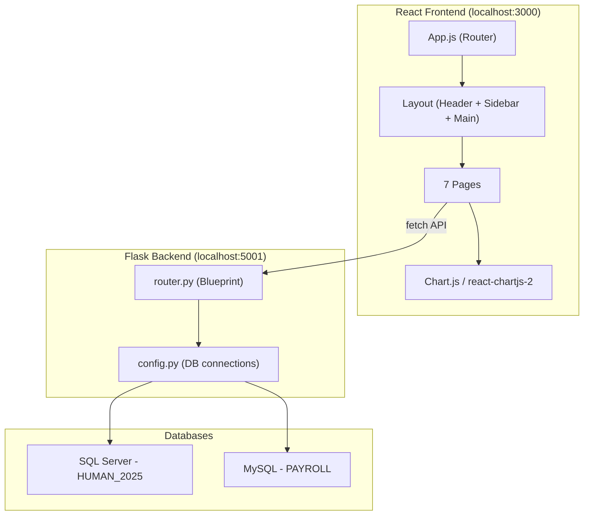

# System Design & Architecture

## Architecture Overview



### Technology Stack
| Layer     | Technology | Purpose |
|-----------|-----------|---------|
| Frontend  | React 19 + react-router-dom v7 | SPA with client-side routing |
| Styling   | Bootstrap 5 + Vanilla CSS | Utility classes + custom premium design system |
| Charts    | Chart.js + react-chartjs-2 | Line, bar, donut, stacked bar charts |
| Backend   | Flask + Flask-CORS | REST API serving JSON |
| DB (HR)   | SQL Server (HUMAN_2025) | Employees, Departments, Positions, Dividends |
| DB (Pay)  | MySQL (PAYROLL) | employees_payroll, salaries, attendance |

## Data Models

### SQL Server — HUMAN_2025 (existing)
```sql
Departments (DepartmentID PK, DepartmentName)
Positions   (PositionID PK, PositionName)
Employees   (EmployeeID PK, FullName, Email, DateOfBirth, Gender, PhoneNumber, HireDate, DepartmentID FK, PositionID FK, Status)
Dividends   (DividendID PK, EmployeeID FK, Amount)
```

### MySQL — PAYROLL (existing)
```sql
employees_payroll (EmployeeID PK, FullName, DepartmentID, PositionID, Status)
attendance        (AttendanceID PK AUTO_INCREMENT, EmployeeID, AttendanceMonth DATE, WorkDays INT, LeaveDays INT, AbsentDays INT)
salaries          (SalaryID PK AUTO_INCREMENT, EmployeeID, SalaryMonth DATE, BaseSalary DECIMAL, Bonus DECIMAL, Deductions DECIMAL, NetSalary DECIMAL)
```

## API Design

### Existing Endpoints (keep)
| Method | Path | Description |
|--------|------|-------------|
| GET | `/api/departments` | List departments |
| GET | `/api/positions` | List positions |
| GET | `/api/employees` | List all employees |
| GET | `/api/employees/<id>` | Get employee detail |
| POST | `/api/employees` | Add employee (2PC: SQL Server + MySQL) |
| PUT | `/api/employees/<id>` | Update employee (2PC) |
| DELETE | `/api/employees/<id>` | Delete employee (2PC) |

### New Endpoints (to add)
| Method | Path | Description |
|--------|------|-------------|
| GET | `/api/payroll` | List payroll records (query: `month`, `employee_id`, `department_id`) |
| GET | `/api/payroll/summary` | Monthly payroll total, department breakdown |
| GET | `/api/attendance` | List attendance records (query: `month`, `employee_id`) |
| GET | `/api/attendance/summary` | Attendance rate and breakdown stats |
| GET | `/api/dashboard/stats` | Aggregated dashboard KPIs |
| GET | `/api/alerts` | List alerts (mock data initially, pending real DB source) |
| PUT | `/api/password` | Update current user's password |

### API Response Patterns
- All responses use `JSON` format
- Error responses: `{"error": "<message>"}` with HTTP status codes
- List responses: plain JSON arrays `[{...}, {...}]`

## Component Breakdown

### Layout Components (modify existing)
- **Header.jsx** — Update branding to "System Integration Project", add notification bell with badge counter, user dropdown with avatar showing "Olivia Chen / Admin"
- **Sidebar.jsx** — 7 navigation items: Dashboard, Employees, Payroll, Attendance, Reports, Alerts (remove Games, Departments, Analytics Hub, Settings, Entertainment)
- **Layout.jsx** — Keep existing structure (Header top, Sidebar left, content right)

### Page Components

#### 1. Dashboard.jsx (rewrite)
- **KPI Cards Row**: Total Employees, Payroll Total (Oct), Attendance Rate
- **Charts Row**:
  - Monthly Performance (multi-line chart — Revenue vs Expenses)
  - Payroll Distribution by Department (donut chart)
  - Employee Status Overview (grouped bar chart)
- **Recent Activities Table**: Sortable with filters (Department, Role, Location, Search)

#### 2. Employees.jsx (enhance)
- **Filter bar**: Search by name/ID, Department dropdown, Position dropdown, Status dropdown
- **+ Add Employee button** → opens AddEmployeeModal component
- **Table columns**: Employee ID, Full Name (with avatar), Department, Position, Status badge, Actions (Edit/Delete/View)
- **AddEmployeeModal.jsx** [NEW]: Full Name, Email, Phone, Department dropdown, Position dropdown, Hire Date, Status radio (Active/Inactive). Replaces separate `/employees/add` page entirely.

#### 3. Payroll.jsx [NEW]
- **Filter bar**: Salary Month date range, Select Employee, Select Department, + Generate Payroll
- **Payroll Overview table**: Salary Month, Base Salary, Bonus, Deductions, Net Salary, View Details
- **Salary Trend chart**: Dual-line (Net Salary vs Base Salary) over time

#### 4. Attendance.jsx [NEW]
- **Filter bar**: Select Month, Select Employee, + Generate Report
- **Attendance Overview table**: Employee Name, Status badge, Work Days, Leave Days (with warning icon if >5), Absent Days, Month
- **Attendance Breakdown stacked bar chart**: Work Days / Leave Days / Absent Days per employee

#### 5. Reports.jsx [NEW]
- **Filter bar**: Date Range picker, Department dropdown, Report Type tabs (HR, Payroll, Attendance, Dividend)
- **Export section**: Export Excel button, Export PDF button
- **Charts row**: Salary by Department (bar), Employee Distribution (donut), Payroll Trend (multi-line)

#### 6. Alerts.jsx [NEW]
- **Filter bar**: Alert Type dropdown, Severity dropdown, + New Alert button
- **Active Alerts table**: Alert Type icon, Employee Name, Message, Severity badge (color-coded), Date, Action link
- **AlertDetailPanel.jsx** [NEW]: Side panel showing employee info, related data section, action buttons

#### 7. Profile.jsx [NEW]
- **User Profile Card**: Avatar, Username, Role, Email
- **Action buttons**: Change Password, Logout

### Shared Components
- **StatCard.jsx** [NEW] — Reusable KPI card component
- **ChartCard.jsx** [NEW] — Wrapper for chart.js charts with title and optional filters

### Files to Delete
- `frontend/src/pages/Games.jsx`
- `frontend/src/pages/UserDashboard.jsx`
- `frontend/src/pages/Departments.jsx`
- `frontend/src/pages/Positions.jsx`
- `frontend/src/pages/Settings.jsx`
- `frontend/src/pages/Analytics.jsx`

## Design Decisions

### Why Chart.js (react-chartjs-2)?
- Lightweight, well-documented, covers all needed chart types (line, bar, donut, stacked bar)
- Easy to customize colors, tooltips, and animations
- Works well with React via react-chartjs-2 wrapper

### UI Design Philosophy
- Follow the case study screenshots as the baseline layout
- Enhance with premium aesthetics: glassmorphism cards, gradient accents, micro-animations
- Professional color palette: indigo primary (#4338ca), with accent colors for severity (green/amber/red)
- Inter font family for clean, modern typography

## Non-Functional Requirements

### Performance
- Dashboard should load in <2 seconds
- Charts should render smoothly without jank
- Tables should handle 200+ rows with pagination (10 items per page)

### Security
- Admin-only access enforced via localStorage role check
- No sensitive data exposed in frontend code
- API calls use relative URLs through proxy or absolute localhost URLs

### Accessibility
- All interactive elements have proper ARIA labels
- Color coding always supplemented with icons/text (e.g., severity badges have both color and text)
- Keyboard navigable sidebar and modals
