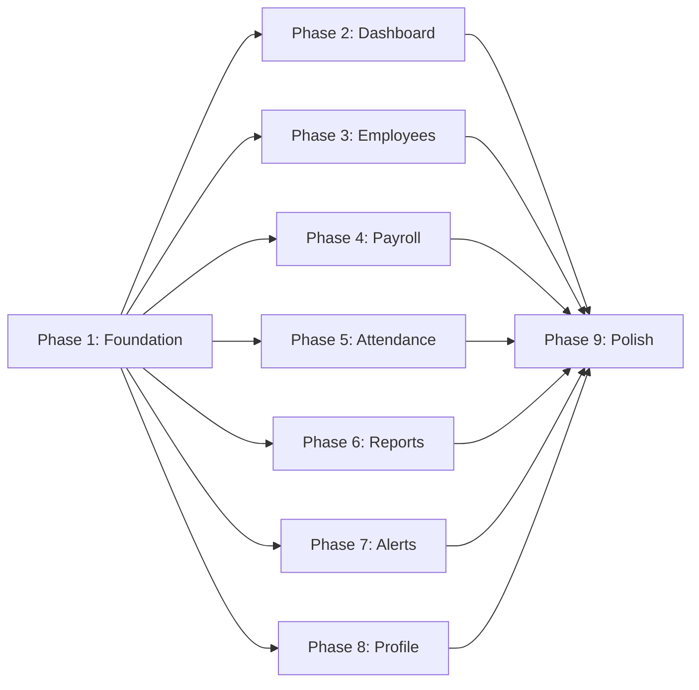

# Project Planning & Task Breakdown

## Milestones

- [x] **M1: Foundation & Cleanup**
- [x] **M2: Dashboard Overview**
- [x] **M3: Employee Management**
- [x] **M4: Payroll Management**
- [x] **M5: Attendance Management**
- [x] **M6: Reports & Analytics**
- [x] **M7: Alerts & Notifications**
- [x] **M8: User Profile**
- [x] **M9: Polish & QA**
- [x] **M10: Alignment Fixes**

## Task Breakdown### Phase 1: Foundation & Cleanup
- [x] **1.1** Install `chart.js` and `react-chartjs-2` via npm
- [x] **1.2** Delete redundant pages: `Games.jsx`, `UserDashboard.jsx`, `Departments.jsx`, `Positions.jsx`, `Settings.jsx`, `Analytics.jsx`, `EmployeeAdd.jsx`
- [x] **1.3** Update `App.js` — remove old routes, add new routes: `/payroll`, `/attendance`, `/reports`, `/alerts`, `/profile`
- [x] **1.4** Update `Sidebar.jsx` — 7 nav items: Dashboard, Employees, Payroll, Attendance, Reports, Alerts + Profile at bottom
- [x] **1.5** Update `Header.jsx` — rebrand to "System Integration Project", enhance user dropdown with profile link
- [x] **1.6** Update `index.css` — expand design system with chart card styles, alert severity colors, animation utilities

### Phase 2: Dashboard Overview (rewrite)
- [x] **2.1** Create `StatCard.jsx` shared component
- [x] **2.2** Rewrite `Dashboard.jsx` — KPI cards row (Total Employees, Payroll Total, Attendance Rate)
- [x] **2.3** Add Monthly Performance line chart (multi-line: Revenue, Expenses, Growth)
- [x] **2.4** Add Payroll Distribution donut chart (by department)
- [x] **2.5** Add Employee Status Overview grouped bar chart (Present/Leave/Remote)
- [x] **2.6** Add Recent Activities & Employees table with department/role/location filters + search + pagination

### Phase 3: Employee Management (enhance)
- [x] **3.1** Add filter dropdowns (Department, Position, Status) to Employees.jsx
- [x] **3.2** Add status badges (Active → green, Inactive → gray, On Leave → amber)
- [x] **3.3** Create `AddEmployeeModal.jsx` — form with all fields, save/cancel, API POST
- [x] **3.4** Add View action (inline detail expansion or modal)
- [x] **3.5** Wire Edit to EmployeeEdit page, ensure all fields populated

### Phase 4: Payroll Management (new)
- [x] **4.1** Add backend `/api/payroll` endpoint (MySQL salaries table)
- [x] **4.2** Add backend `/api/payroll/summary` endpoint
- [x] **4.3** Create `Payroll.jsx` — filter bar (month range, employee, department)
- [x] **4.4** Add Payroll Overview table with columns: Salary Month, Base Salary, Bonus, Deductions, Net Salary, Actions
- [x] **4.5** Add Salary Trend dual-line chart (Net Salary vs Base Salary)
- [x] **4.6** Add "+ Generate Payroll" button (mock action / toast notification)

### Phase 5: Attendance Management (new)
- [x] **5.1** Add backend `/api/attendance` endpoint (MySQL attendance table)
- [x] **5.2** Add backend `/api/attendance/summary` endpoint
- [x] **5.3** Create `Attendance.jsx` — filter bar (month, employee)
- [x] **5.4** Add Attendance Overview table: Employee Name, Status, Work Days, Leave Days (warning >5), Absent Days, Month
- [x] **5.5** Add Attendance Breakdown stacked bar chart
- [x] **5.6** Add "+ Generate Report" button

### Phase 6: Reports & Analytics (new)
- [x] **6.1** Create `Reports.jsx` — filter bar (date range, department dropdown)
- [x] **6.2** Add Report Type tab buttons (HR Report, Payroll Report, Attendance Report, Dividend Report)
- [x] **6.3** Add Export buttons (Export Excel, Export PDF) — mock/placeholder
- [x] **6.4** Add Salary by Department bar chart
- [x] **6.5** Add Employee Distribution donut chart
- [x] **6.6** Add Payroll Trend multi-line chart

### Phase 7: Alerts & Notifications (new)
- [x] **7.1** Create `Alerts.jsx` — filter bar (Alert Type, Severity), + New Alert button
- [x] **7.2** Add Active Alerts table: type icon, employee name, message, severity badge, date, action button
- [x] **7.3** Create `AlertDetailPanel.jsx` — side panel with employee info, related data, action buttons
- [x] **7.4** Implement mock alert data generation (salary anomaly, excessive leave, birthday, work anniversary)

### Phase 8: User Profile (new)
- [x] **8.1** Create `Profile.jsx` — user card with avatar, username, role, email
- [x] **8.2** Add Change Password modal (mock functionality)
- [x] **8.3** Add Logout button functionality

### Phase 9: Polish & QA
- [x] **9.1** Responsive testing — sidebar collapse on mobile, table horizontal scroll
- [x] **9.2** Add CSS micro-animations — card hover lifts, chart fade-ins, button ripples
- [x] **9.3** Verify all chart colors use the design system palette
- [x] **9.4** Test navigation flow — all sidebar links work, active states correct
- [x] **9.5** Console error cleanup — no warnings or errors in dev console
- [x] **9.6** Final visual review against case study screenshots

### Phase 10: Security & Integration Fixes
- [x] **10.1** Implement password hashing in `router.py` using `werkzeug.security`.
- [x] **10.2** Wire `Dashboard.jsx` KPI cards to `/api/dashboard/stats`.
- [x] **10.3** Calculate `attendanceRate` dynamically in `router.py` using the `attendance` table.
- [x] **10.4** Centralize API Base URL in the frontend (e.g., via `src/api.js` or `.env`).
- [x] **10.5** Fix deletions in `/api/employees/<id>` [DELETE] to handle child tables safely.
- [x] **10.6** Replace all chart mock data in `Dashboard.jsx` with real backend data.
- [x] **10.7** Sanitize error responses in `router.py` to avoid leaking DB exceptions.
- [x] **10.8** Migrate hardcoded database credentials in `config.py` to environment variables.

### Phase 11: Implementation Alignment Fixes
- [x] **11.1** Refactor `ExportModal.jsx`: Replace Tailwind CSS classes with Vanilla CSS/Bootstrap.
- [x] **11.2** Sync MySQL Schema: Update `init_schema_mysql.sql` with new columns (Bonus, Deductions) and match naming in `router.py`.
- [x] **11.3** Enhance Dashboard: Add search and Department/Role/Location filters to the Recent Employees table.
- [x] **11.4** Refine Attendance Chart: Upgrade Presence breakdown to a stacked bar chart (Work/Leave/Absent).

### Phase 13: Post-Review Data Consistency
- [x] **13.1** Synchronize Dashboard KPIs with `selectedMonth`. Update frontend feching to send the month parameter to stats API.
- [x] **13.2** Refactor backend `get_dashboard_stats` in `router.py` to handle the `month` parameter and query historical data dynamically.
- [x] **13.3** Centralize dynamic `months` generation utility in `utils.js` (or similar) to remove hardcoded 2023 arrays.
- [x] **13.4** Replace "Recent Employees" static mock data in `Dashboard.jsx` with a live API call to `/api/employees` (sorted by hire date).
- [x] **13.5** Implement chart data limits for Attendance and Payroll views to prevent UI clutter with high employee counts.

### Phase 12: Implementation Alignment Fixes (Part 2)
- [x] **12.1** Update `/api/attendance` and `/api/payroll` [GET] in `router.py` to support `month` query parameters.
- [x] **12.2** Wire `selectedMonth` state in `Attendance.jsx` and `Payroll.jsx` to the backend API.
- [x] **12.3** Refactor `get_dashboard_stats` in `router.py` to use dynamic dates instead of hardcoded `'2023-10-01'`.
- [x] **12.4** Synchronize `docs/ai/design/feature-hr-dashboard-overhaul.md` with the finalized `WorkDays/LeaveDays` schema.
- [x] **12.5** Refactor `Login.jsx` to use the backend `SystemUsers` table for real authentication instead of hardcoded credentials.

## Dependencies

- Phase 1 (Foundation) must complete first — it sets up routes, sidebar, and chart library.
- Phases 2–8 can proceed in parallel after Phase 1.
- Phase 9 (Polish) requires all feature pages to be complete.

## Timeline & Estimates

| Phase | Description | Estimated Effort |
|-------|-------------|-----------------|
| 1 | Foundation & Cleanup | 30 min |
| 2 | Dashboard Overview | 45 min |
| 3 | Employee Management | 30 min |
| 4 | Payroll Management | 45 min |
| 5 | Attendance Management | 40 min |
| 6 | Reports & Analytics | 40 min |
| 7 | Alerts & Notifications | 45 min |
| 8 | User Profile | 20 min |
| 9 | Polish & QA | 30 min |
| **Total** | | **~5.5 hours** |

## Risks & Mitigation

| Risk | Impact | Mitigation |
|------|--------|-----------|
| MySQL salaries/attendance tables may have no data | Charts show empty | Generate realistic seed data via SQL scripts |
| Backend endpoints for payroll/attendance not implemented | Pages can't load real data | Use structured mock data in frontend; swap later |
| Chart.js version conflicts with React 19 | Charts don't render | Pin compatible versions; test early |
| Large employee datasets slow pagination | Poor UX | Server-side pagination for future; client-side OK for <500 records |

## Resources Needed

- **NPM packages**: `chart.js@^4`, `react-chartjs-2@^5`
- **Backend changes**: New API endpoints in `router.py`
- **Database**: May need seed data scripts for salaries and attendance tables
- **Icons**: Bootstrap Icons (already included via CDN or package)
